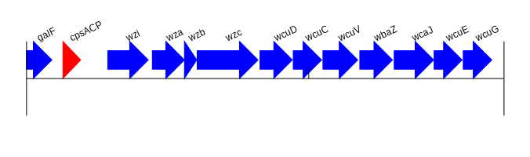

# Description

Plot gene or genome maps and comparisons genome plots. Generate *SVG* and *PDF* images with genoPlotR (http://genoplotr.r-forge.r-project.org/) or GenomeDiagram (https://academic.oup.com/bioinformatics/article/22/5/616/205776).

# Installation

## Method 1: Installation with conda

```bash
# create the environment
conda env create -f env.yaml
# activate the environment
conda activate locus2genoplotr
```

## Method 2: Docker/Singularity container   

Dependency: use either singularity or docker  
 - [Singularity](https://sylabs.io/guides/3.0/user-guide/installation.html)
 - [Docker](https://www.docker.com/)
 - 
### build singularity image 

```bash
# build image
singularity build locus2genoplotr.simg docker://metagenlab/locus2genoplotr:1.1
# execute
singularity exec locus2genoplotr.simg locus2genoplotr -h
```

### build docker image 

```bash
# pull image
docker pull docker://metagenlab/locus2genoplotr:1.1
# run
docker run metagenlab/locus2genoplotr:1.1 locus2genoplotr -h
```


## Usage

Input files are standard genbank files. The idea is to automatically extract the region flanking a target locus and align it with the most similar region in one or multiple other genomes.  

Mandatory arguments are:
- one reference genbank file 
- a target CDS **locus_tag** (should be one of the CDS locus_tag of the reference genbank file)
- optional: one or multiple additional genbank file(s) for comparison 
    - the amino acid sequence of the reference CDS will be extracted and blasted against each genbank file to identify the closest homolog in each target genbank file
    - regions flanking the target locus and the best hit of each target genbank file are aligned with blastn or tblastx
- optional: GC or depth plot of the target region (based on the sequence of the last query)


```
locus2genoplotr [-h] [-l LOCUS] [-r REFERENCE]
                          [-q QUERY [QUERY ...]] [-o OUTPUT_NAME] [-v]
                          [-ls LEFT_SIDE_WINDOW] [-rs RIGHT_SIDE_WINDOW]
                          [-i MIN_IDENTITY] [-sl] [-s SAMTOOLS_DEPTH] [-x]
                          [-g]

optional arguments:
  -h, --help            show this help message and exit
  -l LOCUS, --locus LOCUS
                        locus_tag
  -r REFERENCE, --reference REFERENCE
                        reference genbank
  -q QUERY [QUERY ...], --query QUERY [QUERY ...]
                        target genbank(s)
  -o OUTPUT_NAME, --output_name OUTPUT_NAME
                        output name
  -v, --svg             output svg rather than pdf
  -ls LEFT_SIDE_WINDOW, --left_side_window LEFT_SIDE_WINDOW
                        left siden window
  -rs RIGHT_SIDE_WINDOW, --right_side_window RIGHT_SIDE_WINDOW
                        right side window
  -i MIN_IDENTITY, --min_identity MIN_IDENTITY
                        minimum identity for blast
  -sl, --show_labels    do not show show labels
  -s SAMTOOLS_DEPTH, --samtools_depth SAMTOOLS_DEPTH
                        add depth plot from samtool depth (only for the last
                        query). Should match the chromosome/contig names of
                        the gbk.
  -x, --tblastx         execute tblastx and not blasn (6 frame translations)
  -g, --gc_plot         Show GC plot

```

## examples


### simple plot 

The script can be used to generate simple svg plots of a single target region

```bash
locus2genoplotr -l KL24_00002 -r data/K24.gbk -o single_plot -v
```



### increase region size

The region size can be increazed with "left side" (-ls) and "right side" (-rs) arguments.

```bash
locus2genoplotr -l KL24_00002 -r data/K24.gbk -o single_plot -v -rs 45000 
```


### simple plot : comparative plot

```bash
locus2genoplotr -l KL28_00008 -r data/KL28.gbk -q data/capsule_region_150bp_assembly_concat.gbk data/capsule_region_250bp_assembly_concat.gbk -rs 45000 -ls 30000 -o simple_comp -v
```


### comparative plot tblastx

```bash
locus2genoplotr -l KL24_00002 -r data/K24.gbk -q data/GCF_001596925.1_ASM159692v1_genomic.gbff data/GCF_000943095.1_ST15_genomic.gbff data/K24.gbk -rs 25000 -ls 3000 -x -o alignment_tblastx
```


### comparative plot with GC 

```bash
locus2genoplotr -l KL28_00008 -r data/KL28.gbk -q data/capsule_region_150bp_assembly_concat.gbk data/capsule_region_250bp_assembly_concat.gbk -rs 45000 -ls 30000 -s data/capsule_region_250bp_assembly_concat.depth_150bp_reads -o capsule_with_gc -v
```


### comparative plot with sequencing depth 

```bash
locus2genoplotr -l KL28_00008 -r data/KL28.gbk -q data/capsule_region_150bp_assembly_concat.gbk data/capsule_region_250bp_assembly_concat.gbk -rs 45000 -ls 30000 -o capsule_with_gc -v -g
```


# TODO 

- [ ] deal with combined GC and depth plots 
